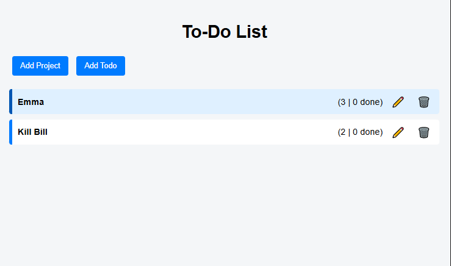
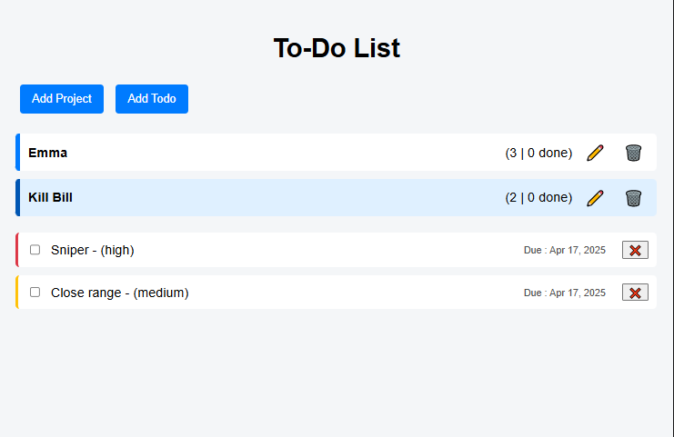

# To-Do-List

A dynamic and fully-featured To-Do List application built using JavaScript, modular architecture, and Webpack. It allows users to manage multiple projects, add/edit tasks, set priorities and due dates, and store data using localStorage.

## Table of Content

* [Featutes](#fearures)
* [Installation & Usage](#installation-&-usage)
* [Technologies used](#technologies-used)
* [Contributions](#contributions)
* [Contact](#contact)

## Features

- 📁 Create and manage multiple projects
- ✅ Add, complete, and delete to-dos
- ⏳ Due date and ⬆️ priority assignment for each task
- 📝 Edit project names and tasks
- 💾 Persists data with localStorage
- 📦 Built with Webpack and modular JS architecture
- 🎨 Responsive and clean UI styling

## 🔧 Installation & Usage
1. Clone the repository  

   git clone https://github.com/hencci/to-do-list.git   
   cd to-do-list

2. Install dependencies  

   npm install

3. Run the development server

   npm start

4. Build for production

   npm run build

## Technologies Used

- JavaScript (ES6 Modules)
- HTML5 & CSS3
- Webpack (with dev server)
- date-fns (for formatting due dates)
- localStorage (for data persistence)

## 📸 Screenshots

## 📜 License

This project is open-source and available under the MIT License.

## 💡 Contributions

Feel free to fork this repository and improve the project! 🚀
PRs are welcome! 😊

## Live preview

https://hencci.github.io/to-do-list

## Contact

Created by [Henry Moses](https://github.com/hencci)
Feel free to reach out if you have any questions